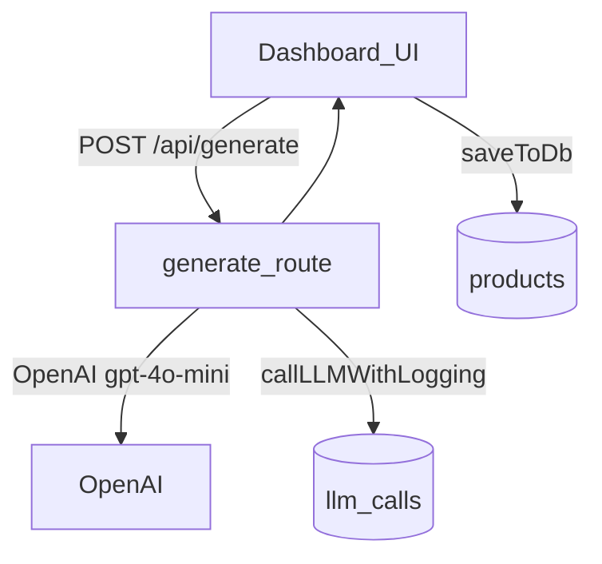
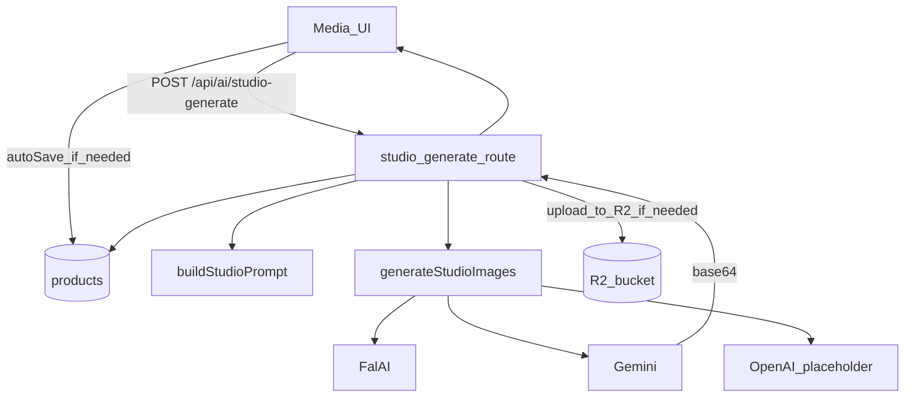

# LLMs & AI Models — Product Architect

This document is the **authoritative reference** for all AI/LLM usage in this repo: which models are called, how prompts are constructed, how org settings affect generation, how logging works, and how to swap providers safely.

> Scope: what exists in the repository today (not theoretical future architecture).

---

## AI feature map (what calls which model)

### Text / JSON generation (OpenAI)
All text generation in this repo uses the OpenAI Chat Completions API with:
- **Model:** `gpt-4o-mini`
- **SDK:** `openai` (Node)
- **Shared logging wrapper:** `src/lib/llm/logger.ts` (`callLLMWithLogging`)

Where used:
- **Product copy generation**: `POST /api/generate` → `src/app/api/generate/route.ts`
- **Field enhancer**: `POST /api/enhance` → `src/app/api/enhance/route.ts`
- **Translation**: `POST /api/translate` → `src/app/api/translate/route.ts`
- **JUST DROP IT ingest**: `POST /api/products/ingest` → `src/app/api/products/ingest/route.ts`
  - classification: `src/lib/ingest/classifier.ts`
  - evidence extraction: `src/lib/ingest/extractor.ts`
  - blueprint generation: `src/lib/ingest/blueprint-generator.ts`

### Image generation (Studio Photo)

Studio Photo is designed as a provider-adapter with pluggable backends:
- **Route:** `POST /api/ai/studio-generate` → `src/app/api/ai/studio-generate/route.ts`
- **Provider adapter:** `src/lib/ai/imageProvider.ts`
- **Providers:**
  - fal.ai: `src/lib/ai/providers/fal.ts` (`@fal-ai/client`)
  - Gemini: `src/lib/ai/providers/gemini.ts` (`@google/genai`)
  - OpenAI: `src/lib/ai/providers/openai.ts` (**placeholder** today; returns safe placeholder URLs until OpenAI image-to-image is wired)

Provider selection comes from:
- **Default provider/model (org settings)**: `organization_settings.ai_image_provider`, `organization_settings.ai_image_model`
- **Per-request overrides (modal payload)**: `provider`, `providerModel`

Outputs are normalized into **public URLs**:
- Providers may return `url` or `base64` (Gemini typically returns base64 inline parts).
- The route uploads base64 outputs into R2 and persists the resulting public URLs.

---

## Settings that affect AI

### Where settings live
Settings are per-organization and stored in Supabase `organization_settings`.

Key files:
- UI: `src/app/settings/page.tsx`
- Server actions (encrypt/decrypt, load/save): `src/app/settings/actions.ts`
- Client schema: `src/lib/settings-schema.ts`
- Zustand store: `src/store/useSettingsStore.ts`

### Secrets (encrypted at rest)
Secrets are encrypted using AES-256-GCM (`src/lib/crypto.ts`) and are **never returned to the browser** once saved.

Secret fields (org-scoped):
- OpenAI: `openai_api_key`
- R2: `r2_account_id`, `r2_access_key_id`, `r2_secret_access_key`
- Medusa: `medusa_api_key`
- fal.ai: `fal_api_key`
- Gemini: `gemini_api_key`

Fallback (optional) env vars if org keys are not set:
- `OPENAI_API_KEY`
- `FAL_API_KEY`
- `GEMINI_API_KEY`

Secret handling rules (“replace semantics”) in `src/app/settings/actions.ts`:
- **empty string** = keep existing secret
- **non-empty** = replace existing secret
- **null** = clear secret (server-supported)

### Non-secret AI defaults
AI Studio provider defaults (org-scoped):
- `ai_image_provider` (e.g. `openai` | `fal` | `gemini`)
- `ai_image_model` (provider model identifier; optional)

---

## Prompt sources & how prompts are built

### Brand + instructions (copy/translate/enhance)
These org settings flow into system prompts in:
- `src/app/api/generate/route.ts`
- `src/app/api/enhance/route.ts`
- `src/app/api/translate/route.ts`
- `src/app/api/products/ingest/route.ts` (JUST DROP IT flow)

Fields:
- `brand_name`
- `brand_voice`
- `custom_instructions`

#### Key rule
These routes **treat LLM output as untrusted**:
- Inputs are validated with Zod (`src/lib/api-schemas.ts`)
- Outputs are parsed and/or schema-validated server-side before returning to the browser
  - Example: `/api/generate` validates against a local Zod `ProductSchema`

### Studio Photo prompt library (editable)
Studio Photo prompting is driven by a **baseline prompt library** and optional org overrides.

Baseline library (embedded module):
- `src/lib/ai/promptLibrary.ts` exports `PROMPT_LIBRARY_JSON` (the canonical default)

Org overrides (stored in `organization_settings`):
- `ai_studio_prompt_library` (jsonb)
- `ai_studio_toggle_phrases` (jsonb)

Structured editor UI:
- `/settings/ai-studio` → `src/app/settings/ai-studio/page.tsx`

Prompt builder:
- `src/lib/ai/studioPrompt.ts`
  - Always includes preserve-identity and no-watermark rules
  - Combines: global base + setup prompt + model prompt + toggle phrases + darkness hint

**Guardrails (always enforced):**
- Preserve identity rule
- No watermarks/logos/text

---

## System prompts (high-level summaries)

### `/api/generate` (Product copy generation)
- File: `src/app/api/generate/route.ts`
- System message: “You are the lead Product Architect and Head of Copy for {brandName}… Return ONLY valid JSON…”
- Inputs:
  - `prompt` (text)
  - optional `image` (data URL) as `image_url` part (vision)
- Response format: JSON object (enforced via `response_format: json_object`)

### `/api/enhance` (Field enhancer)
- File: `src/app/api/enhance/route.ts`
- System message: brand voice + field-specific instructions + strict “return only enhanced text”
- Max tokens depend on field:
  - description: 500
  - keywords: 100 (comma-separated list → server parses into array)
  - other fields: 150

### `/api/translate` (Localization translation)
- File: `src/app/api/translate/route.ts`
- System message: translator instructions; must return exact JSON structure
- Response format: JSON object

### JUST DROP IT ingest pipeline
- Route: `src/app/api/products/ingest/route.ts`
- Pipeline steps logged as `pipeline_events`:
  - classification → extraction → blueprint generation
- Uses `gpt-4o-mini` with JSON response format for structured extraction and blueprint output.

---

## Observability: LLM logging, costs, and redaction

### Tables
Migrated in repo:
- `llm_sessions`
- `llm_calls`
- `pipeline_events`

Migration:
- `supabase/migrations/20250127000000_create_llm_logging_tables.sql`

### Wrapper: `callLLMWithLogging`
- File: `src/lib/llm/logger.ts`
- Responsibility:
  - executes the OpenAI call
  - logs prompt/response previews (minimized)
  - logs token usage + cost estimates
  - updates `llm_sessions` totals
- Important: logging failures are **non-fatal** (should not break user flows).

### Redaction/minimization
- `src/lib/llm/redaction.ts` and `minimizeContent(...)`
- Prompts and responses stored are minimized to avoid large payloads and reduce sensitive leakage risk.

### Cost estimation
- `src/lib/llm/cost-calculator.ts`
- Used during session total updates

---

## End-to-end flows (diagrams)

### Copy generation (`/api/generate`)

### Studio Photo generation (`/api/ai/studio-generate`)

---

## Operational notes (migrations)

If you see errors like:
> “Could not find the '...' column of 'organization_settings' in the schema cache”

It means migrations were not applied (or PostgREST schema cache hasn’t reloaded).

Relevant migrations:
- `supabase/migrations/20251231010000_add_ai_image_providers_to_org_settings.sql`
- `supabase/migrations/20251231011000_add_ai_studio_prompt_library_to_org_settings.sql`

